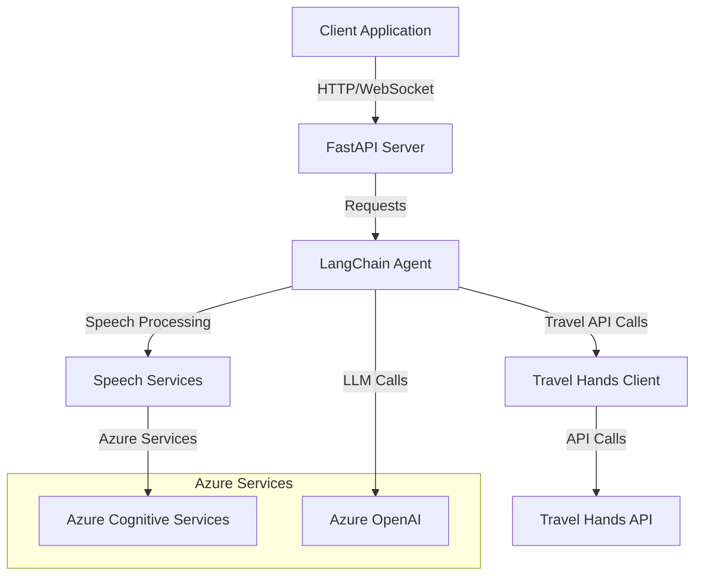
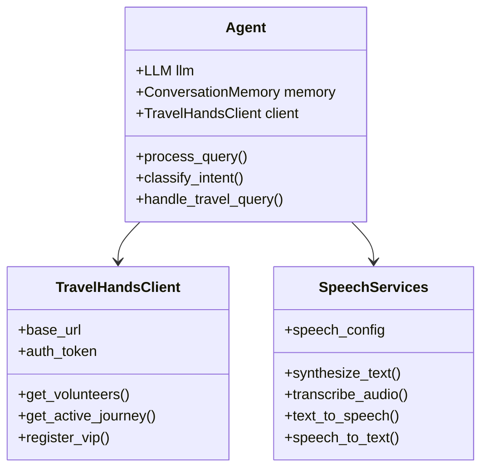
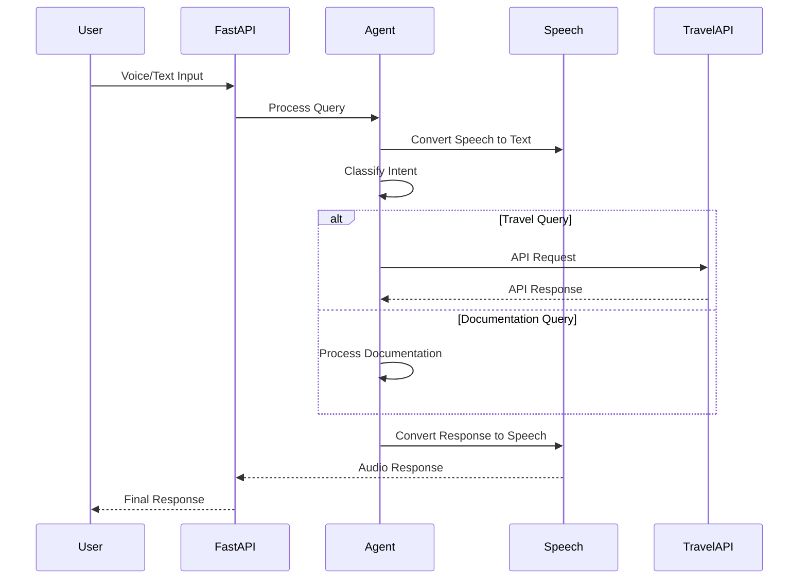
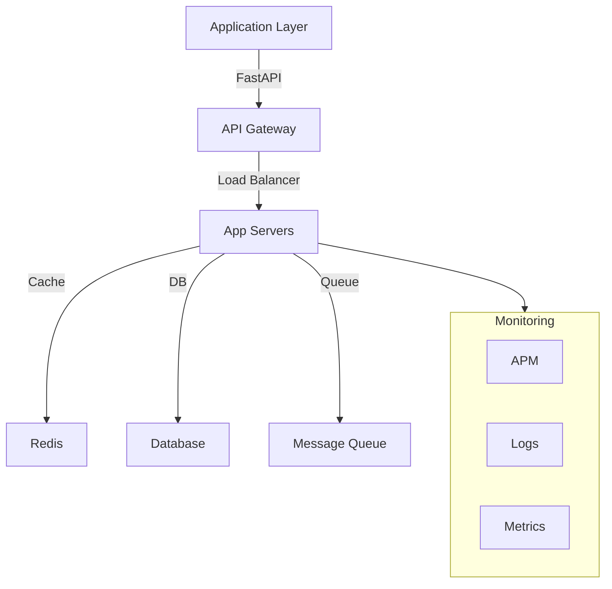

# Voice Agent System Architecture

## System Overview



## Core Components

### Component Architecture



## Data Flow



## Production Readiness Assessment

### Current Status
The system is currently in a development state and requires several enhancements before being production-ready.

### Critical Areas for Production

1. **Infrastructure Requirements**
   - Load balancing configuration
   - Auto-scaling setup
   - High availability architecture
   - Proper monitoring and alerting
   - Backup and disaster recovery

2. **Security Measures**
   - API authentication and authorization
   - Input validation and sanitization
   - Rate limiting
   - Security headers
   - Data encryption at rest and in transit

3. **Performance Optimization**
   - Caching layer implementation
   - Database connection pooling
   - Query optimization
   - Resource usage optimization

4. **Monitoring and Observability**
   - Centralized logging system
   - Application performance monitoring
   - Error tracking and alerting
   - User analytics
   - Health checks

5. **DevOps Requirements**
   - CI/CD pipeline setup
   - Automated testing
   - Environment management
   - Infrastructure as Code
   - Deployment strategies (Blue-Green/Canary)

### Steps to Production

1. **Infrastructure Setup**
   ```mermaid
   graph TD
       A[Development] -->|CI/CD| B[Staging]
       B -->|Testing| C[Production]
       C -->|Monitoring| D[APM]
       C -->|Logging| E[ELK Stack]
       C -->|Metrics| F[Prometheus]
   ```

2. **Required Enhancements**
   - Implement proper error handling and recovery
   - Add comprehensive logging
   - Set up monitoring and alerting
   - Implement caching
   - Add security measures
   - Set up CI/CD pipelines
   - Create deployment automation
   - Implement scaling policies

3. **Performance Targets**
   - Response time: < 200ms
   - Availability: 99.9%
   - Error rate: < 0.1%
   - Concurrent users: 1000+

### Production Checklist

- [ ] Complete security audit
- [ ] Implement monitoring
- [ ] Set up logging
- [ ] Configure auto-scaling
- [ ] Implement caching
- [ ] Set up CI/CD
- [ ] Create documentation
- [ ] Perform load testing
- [ ] Set up backup and recovery
- [ ] Configure alerts

## Production Readiness Analysis

The current codebase requires significant enhancements before it can be considered production-ready. Here's a detailed analysis:

### Current Strengths
1. Well-structured modular architecture
2. Clear separation of concerns
3. Basic error handling in place
4. Integration with enterprise services (Azure)

### Areas Needing Improvement

1. **Reliability**
   - Lack of proper error recovery mechanisms
   - Missing retry policies for external services
   - No circuit breakers for API calls
   - Limited fault tolerance

2. **Scalability**
   - No caching implementation
   - Missing connection pooling
   - No load balancing configuration
   - Limited concurrent request handling

3. **Security**
   - Basic authentication only
   - Missing rate limiting
   - Limited input validation
   - No security headers
   - Missing OWASP security measures

4. **Observability**
   - Limited logging implementation
   - No centralized logging
   - Missing APM integration
   - Limited metrics collection

5. **Maintainability**
   - Incomplete documentation
   - Limited test coverage
   - Missing deployment automation
   - No performance benchmarks

### Recommendations for Production

1. **Immediate Actions**
   - Implement comprehensive error handling
   - Add security measures
   - Set up monitoring and logging
   - Implement caching
   - Add rate limiting
   - Increase test coverage

2. **Short-term Improvements**
   - Set up CI/CD pipeline
   - Implement auto-scaling
   - Add performance monitoring
   - Create deployment automation
   - Implement backup strategy

3. **Long-term Enhancements**
   - Implement feature flags
   - Add A/B testing capability
   - Set up analytics
   - Create disaster recovery plan
   - Implement blue-green deployments

### Technology Stack for Production



## Conclusion

While the current codebase provides a solid foundation, significant work is needed to make it production-ready. The focus should be on implementing proper security measures, improving reliability, adding monitoring capabilities, and setting up proper DevOps practices. Following the recommendations above will help create a robust, scalable, and maintainable production system.
