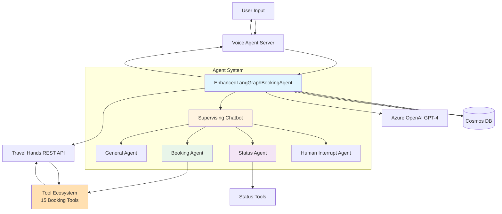
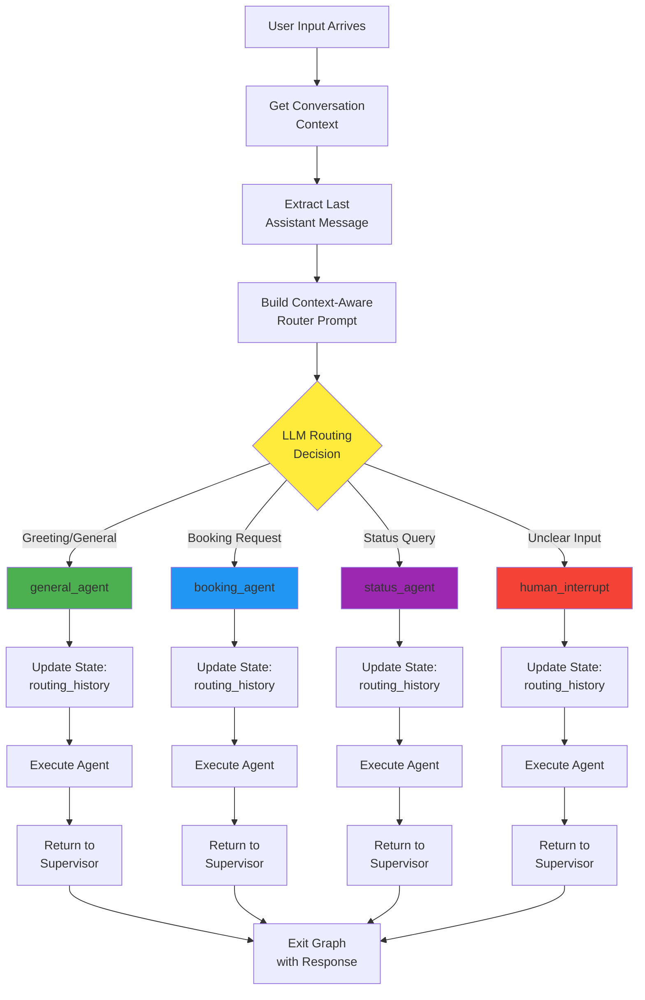
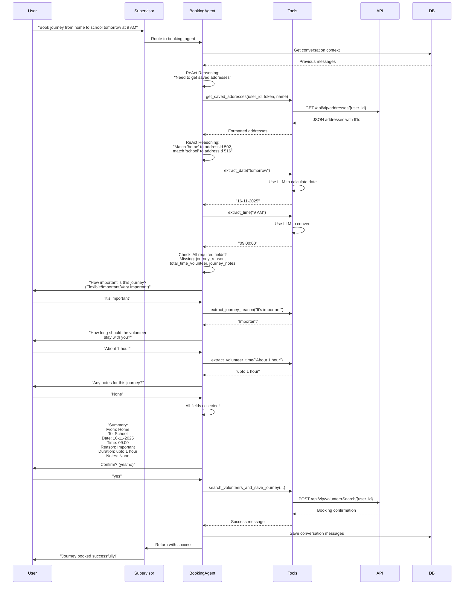
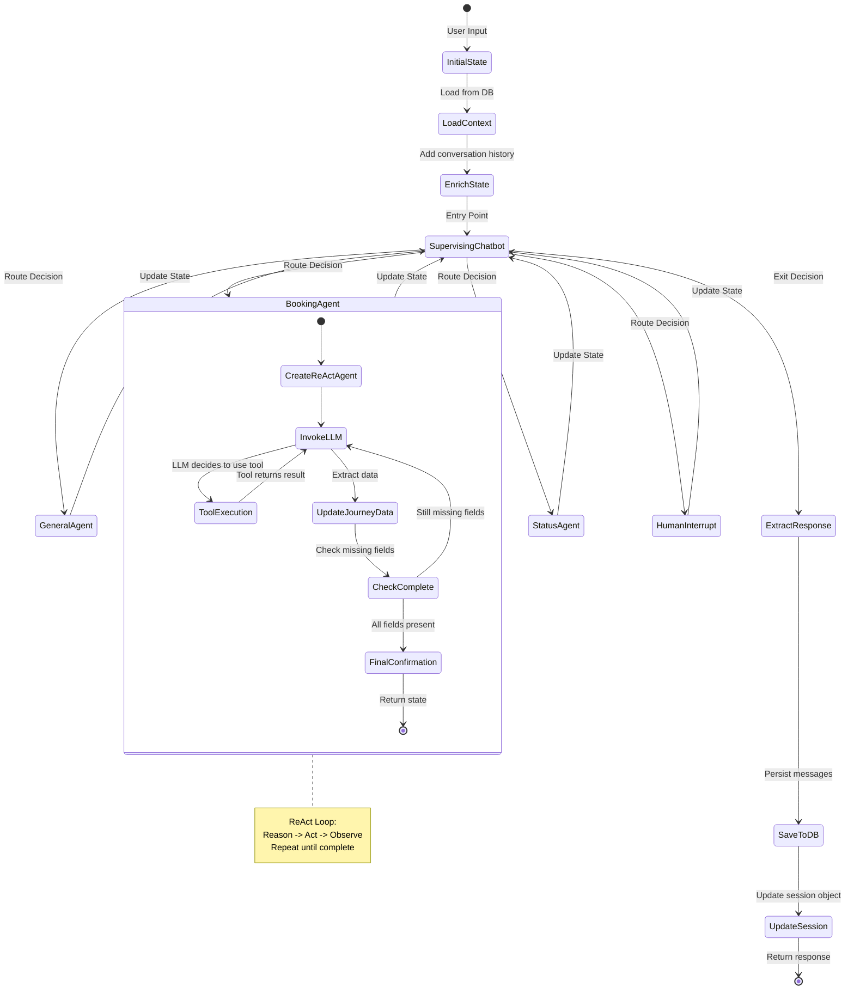
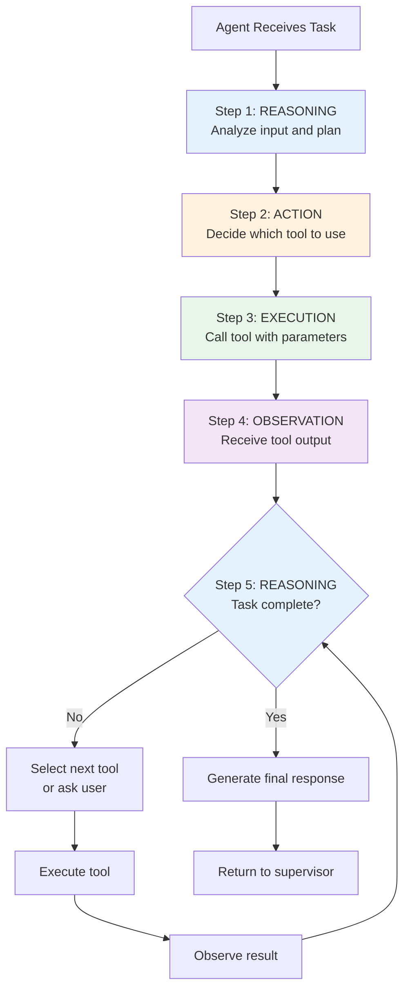
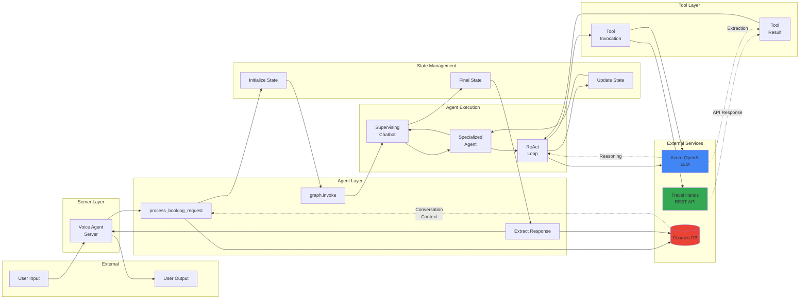
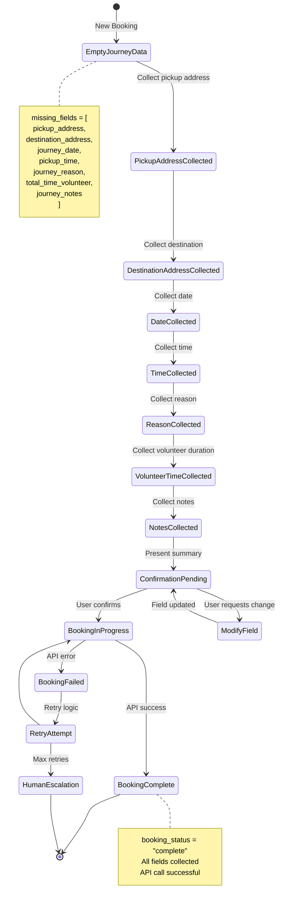
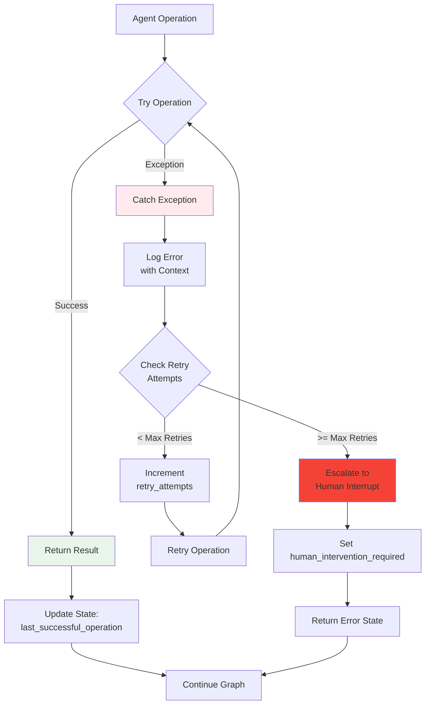
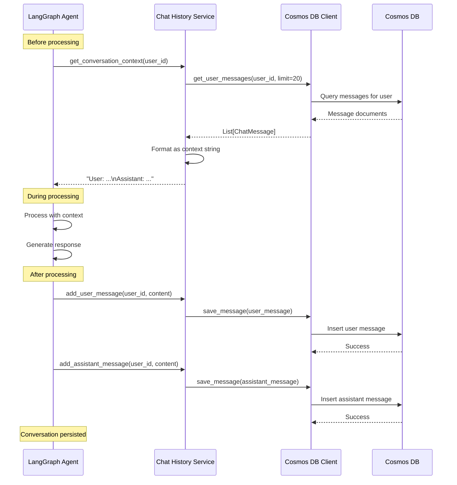

# EnhancedLangGraphBookingAgent - Visual Diagrams

## 1. High-Level System Architecture



## 2. Supervisor Routing Logic Flow



## 3. Booking Agent Workflow



## 4. State Lifecycle



## 5. Tool Invocation Pattern (ReAct)



## 6. Data Flow Through System



## 7. Journey Booking State Transitions



## 8. Tool Ecosystem Organization

```mermaid
graph TB
    subgraph "Booking Tools (15 tools)"
        subgraph "Address Management"
            T1[get_saved_addresses]
            T2[save_new_address]
            T3[validate_address]
        end
        
        subgraph "Date Processing"
            T4[extract_date]
            T5[validate_date]
            T6[format_date]
        end
        
        subgraph "Time Processing"
            T7[extract_time]
            T8[validate_time]
            T9[format_time]
        end
        
        subgraph "Volunteer Duration"
            T10[extract_volunteer_time]
            T11[validate_volunteer_time]
            T12[map_volunteer_time]
        end
        
        subgraph "Journey Metadata"
            T13[extract_journey_reason]
            T14[validate_journey_data]
        end
        
        subgraph "API Operations"
            T15[search_volunteers_and_save_journey]
        end
    end
    
    subgraph "Status Tools (4 tools)"
        S1[get_journey_status]
        S2[get_volunteer_contact]
        S3[update_journey_status]
        S4[cancel_journey]
    end
    
    BookingAgent[Booking Agent] --> T1
    BookingAgent --> T2
    BookingAgent --> T3
    BookingAgent --> T4
    BookingAgent --> T5
    BookingAgent --> T6
    BookingAgent --> T7
    BookingAgent --> T8
    BookingAgent --> T9
    BookingAgent --> T10
    BookingAgent --> T11
    BookingAgent --> T12
    BookingAgent --> T13
    BookingAgent --> T14
    BookingAgent --> T15
    
    StatusAgent[Status Agent] --> S1
    StatusAgent --> S2
    StatusAgent --> S3
    StatusAgent --> S4
    
    T1 --> API[Travel Hands API]
    T2 --> API
    T15 --> API
    S1 --> API
    S2 --> API
    S3 --> API
    S4 --> API
    
    T4 --> LLM[Azure OpenAI]
    T7 --> LLM
    T10 --> LLM
    T13 --> LLM
    
    style BookingAgent fill:#2196f3
    style StatusAgent fill:#9c27b0
    style API fill:#34a853
    style LLM fill:#4285f4
```



## 9. Error Handling Flow



## 10. Database Integration Pattern



## 11. Complete Request-Response Cycle

```mermaid
graph TB
    Start([User: "Book journey from<br/>home to school tomorrow"]) --> VoiceServer[Voice Agent Server]
    
    VoiceServer --> ProcessRequest[process_booking_request]
    
    ProcessRequest --> GetHistory[Get Conversation<br/>History from DB]
    
    GetHistory --> InitState[Initialize State<br/>with Context]
    
    InitState --> GraphInvoke[graph.invoke<br/>with config]
    
    GraphInvoke --> Entry[Entry: Supervising<br/>Chatbot]
    
    Entry --> Route{Route Decision}
    
    Route --> BookingAgent[Booking Agent]
    
    BookingAgent --> ReAct1[ReAct: Get addresses]
    ReAct1 --> Tool1[Tool: get_saved_addresses]
    Tool1 --> API1[API Call]
    API1 --> ReAct2[ReAct: Match addresses]
    
    ReAct2 --> ReAct3[ReAct: Extract date]
    ReAct3 --> Tool2[Tool: extract_date]
    Tool2 --> LLM1[LLM: Parse "tomorrow"]
    LLM1 --> ReAct4[ReAct: Extract time]
    
    ReAct4 --> CheckMissing{Missing Fields?}
    
    CheckMissing -->|Yes| AskUser[Ask User for<br/>Missing Info]
    AskUser --> UpdateState1[Update State]
    UpdateState1 --> ReturnSuper1[Return to Supervisor]
    ReturnSuper1 --> ExitGraph[Exit Graph]
    
    CheckMissing -->|No| Confirm[Ask for Confirmation]
    Confirm --> UpdateState2[Update State]
    UpdateState2 --> ReturnSuper2[Return to Supervisor]
    ReturnSuper2 --> ExitGraph
    
    ExitGraph --> ExtractResp[Extract Response<br/>from State]
    
    ExtractResp --> SaveDB[Save Messages<br/>to Cosmos DB]
    
    SaveDB --> UpdateSession[Update Session<br/>Object]
    
    UpdateSession --> Return([Return Response<br/>to User])
    
    style Start fill:#e3f2fd
    style Return fill:#e8f5e9
    style BookingAgent fill:#fff3e0
    style Tool1 fill:#f3e5f5
    style Tool2 fill:#f3e5f5
    style API1 fill:#c8e6c9
    style LLM1 fill:#bbdefb
```

## Summary

These diagrams illustrate:

1. **System Architecture**: Overall structure and component relationships
2. **Routing Logic**: How the supervisor makes decisions
3. **Agent Workflows**: Detailed booking agent sequence
4. **State Lifecycle**: State transitions during booking
5. **ReAct Pattern**: Tool invocation pattern
6. **Data Flow**: Complete data movement through system
7. **State Transitions**: Journey data collection progress
8. **Tool Organization**: Tool categorization and relationships
9. **Error Handling**: Exception and retry flows
10. **Database Integration**: Persistence pattern
11. **Complete Cycle**: End-to-end request-response flow

Each diagram can be rendered using Mermaid-compatible tools or directly in GitHub/GitLab markdown.
